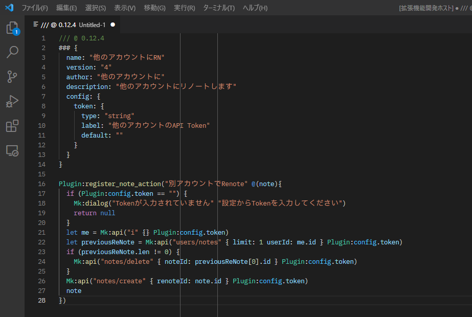

# AiScript Highlighting VSCode Extention (Experimental)



## Features

AiScript Highlighting is an extension for Visual Studio Code that provides syntax highlighting for AiScript. We are planning to support Language Server in the future.

## How to Install

Head to the [releases page](https://github.com/misskey-dev/aiscript-vscode/releases) and download the latest version of the `.vsix` file.

## Requirements

Works with Visual Studio Code v1.83.0 or later

## Release Notes

Please refer to CHANGELOG.md

## Development

### Build Locally

Run:

```bash
$ npx vsce package
```
